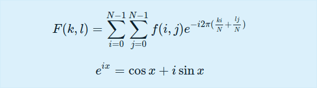
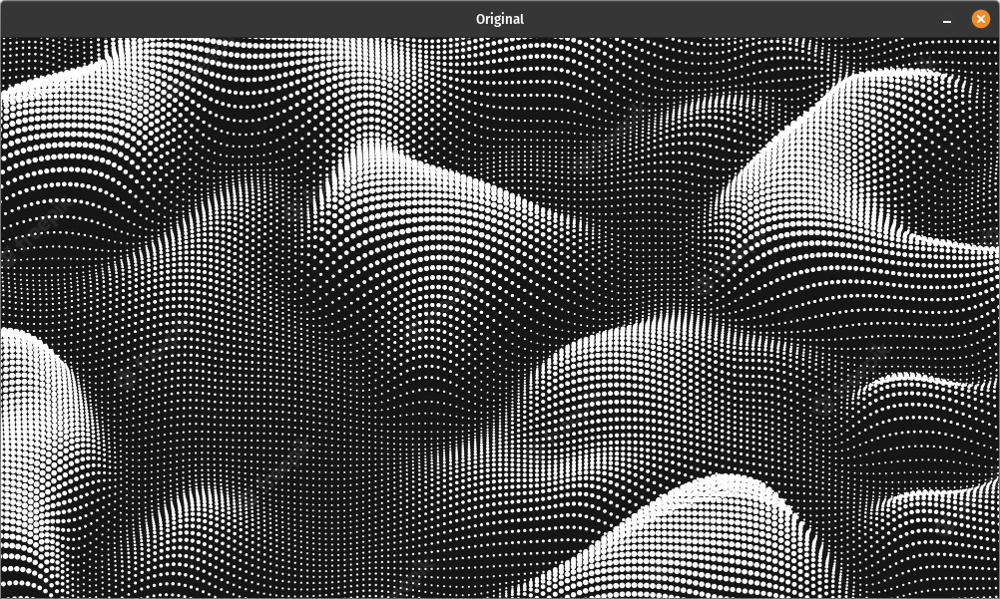
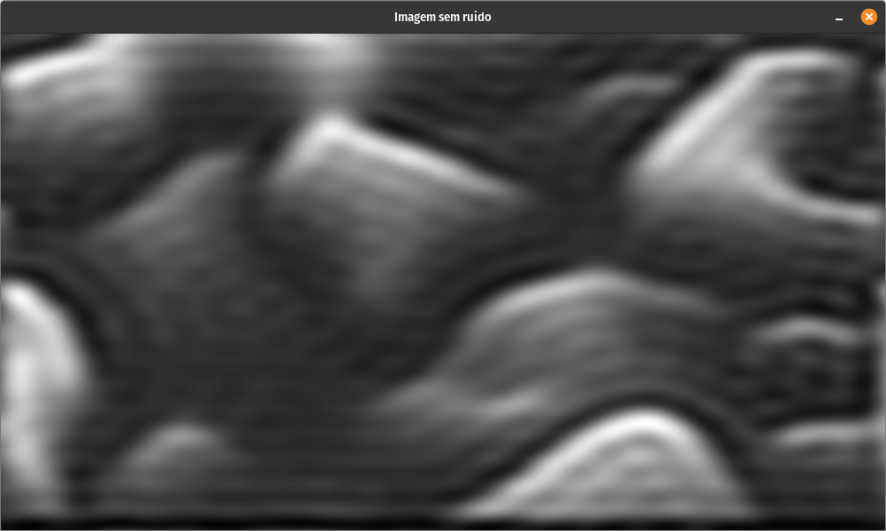
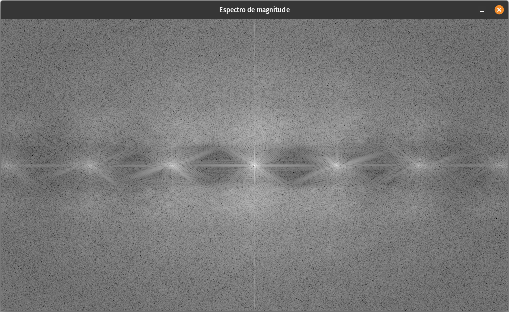

# Uma aplicação usando a Transformada de Fourier, para a disciplina de Sinais e Sistemas do curso de Engenharia de Computação, campus Quixadá

### Por: [Isaac Vinícius](https://www.linkedin.com/in/isaacvinicius), [Hugo Bessa](https://www.linkedin.com/in/hugo-bessa-0287951b0)

---

## Descrição

O objetivo dessa aplicação é utilizar a transformada de Fourier na área de Processamento Digital Imagens (PDI), para remover ruídos de uma determinada imagem e analisar os resultados obtidos. Podemos resumir que a Transformada de Fourier separa uma imagem em componentes de seno e cosseno. Em outras palavras, ele mudará o domínio espacial de uma imagem para o domínio da frequência. No projeto é usado a Transformada Discreta de Fourier (DFT), visto que as imagens digitais não são contínuas.

## Representação Matématica para imagem bidimensional



## Resultados



**Uma amostra da imagem sem ruído:**





## Ambiente utilizado

* linguagem C++

* POP_OS 22.04 LTS

* VSCODE

* Biblioteca OpenCV (Necessária para compilar o projeto)
  * Instalação [aqui](https://github.com/isaacvssilva/Learning-C-Plus-Plus/blob/main/recursos/install-opencv-cpp.md).

## Compilação

```sh
make
```

## Limpar objetos

```sh
make clean
```

---

## Referências

[KAEHLER, Adrian; BRADSKI, Gary. Learning OpenCV 3: computer vision in C++ with the OpenCV library. " O'Reilly Media, Inc.", 2016.](https://www.amazon.com.br/Learning-OpenCV-3-Adrian-Kaehler/dp/1491937998)

[Frequency domain filtration](https://vgg.fiit.stuba.sk/2012-05/frequency-domain-filtration/)

[Fourier Transform for Image Processing in Python from scratch](https://medium.datadriveninvestor.com/fourier-transform-for-image-processing-in-python-from-scratch-b96f68a6c30d)

[OpenCV Fourier Transform using C++](https://anothertechs.com/programming/cpp/opencv-fourier-transform-cpp/)

[Processamento Digital de Imagens](https://agostinhobritojr.github.io/)
